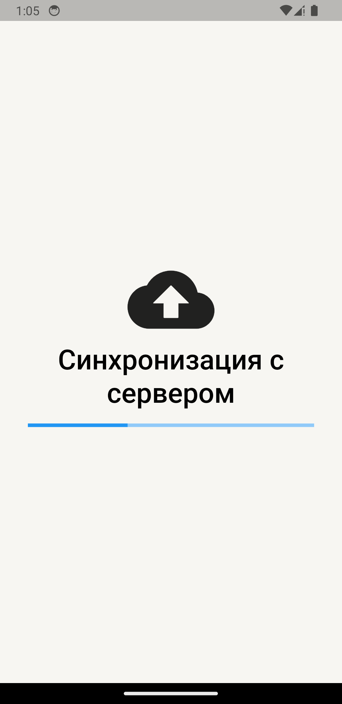
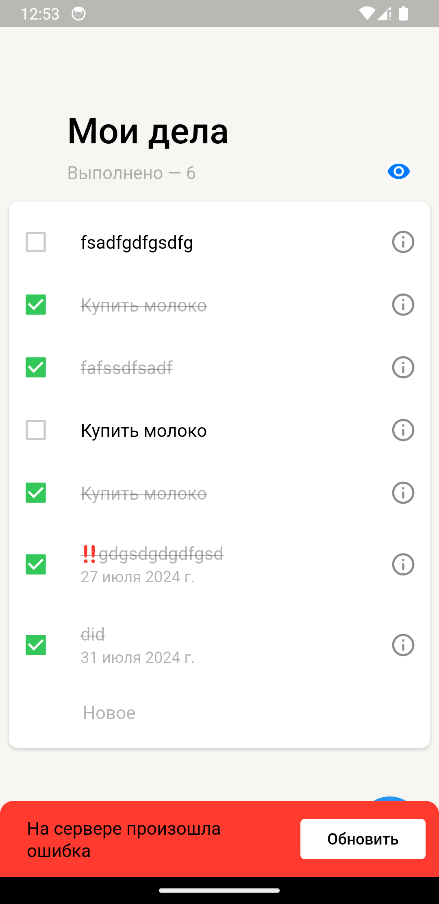
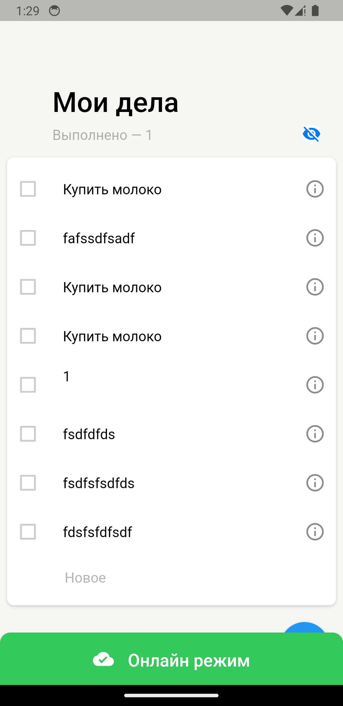
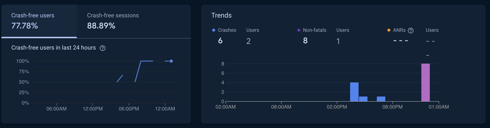
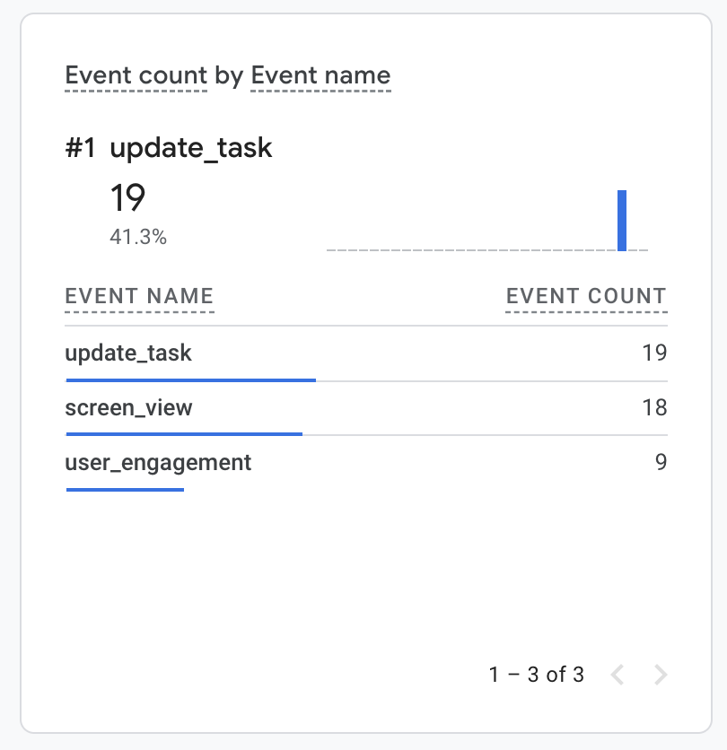
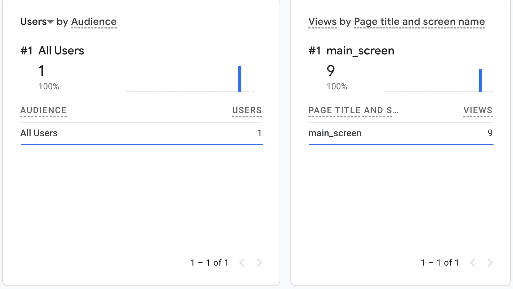

# yandex_todo_list
### Не было, не было и вот опять!
# "Величайший туду лист" - задание с ШМР Яндекс трек Flutter

## Список фич на данный момент
- Мейн списочек задач на главном экране.
- В хедере указано количество выполненных задач, также с помощью "глазика" можно их скрыть или отобразить.
- Уникальность внешний вид у задач разного приоритета.
- Отображение даты дедлайна.
- 2 опции свайпа: вправо - отметить задачу как выполненную, влево - удалить задачу из списка.
- Можно зайти в создание/редактирование фичи, выбрать там дату дедлайна, приоритет и описать суть задачи.
- Все задачи хранятся на сервере.
- Также при стягивании данных с сервера задачки сохраняются в локальную бдшку.
- Предусмотрена работа в оффлайн режиме.
- В случае возниковения ошибок появляется SnackBar с указанием ошибки и с кнопкой обновления списка.
- Реализована поддержка диплинков.
- Интеграция с Firebase:
  - Реализована отправка репортов в Crashlytics
  - Реализована отправка ивентов Analytics
- Реализованы 2 флейвора production и development
- Имеется поддержка landscape режима


## Диплинки
Для перехода на экран добавления задачи используем диплинк
```
yatodo://legendary.com/add
```


## Запуск проекта
После того, как склоните проект выполняете скрипт `setup.sh`:
```
sh scripts/setup.sh
```
Внутри скрипта без fvm указано, если надо - добавьте


Чтобы запустить в дебаге, надо создать `launch.json`,в него вставляете этот код с подстановкой вашего токена(`APP_TOKEN`) и `BASE_URL`
```json
{
    "configurations": [
        {
            "name": "Flutter",
            "request": "launch",
            "type": "dart",
            "flutterMode": "debug",
            "toolArgs": [
                "--dart-define",
                "BASE_URL=<...>",
                "--dart-define",
                "APP_TOKEN=<...>",
            ],
            // Чтобы убедиться в работоспособности flavors добавляем args.
            // Тогда у названия будет приписка DEV
            "args": [
                "--flavor", "development"
            ]
        }
    ]
}
```
Тесты также запускаются с флагом **--dart-define**
```
flutter test integration_test/tests/change_done_test.dart --dart-define BASE_URL=<BASE_URL> --dart-define APP_TOKEN=<YOUR_TOKEN> --flavor development
```

## Скриншотики

<div  style=" justify-content: center;">
    
    
    
    
    
    
    
    
    
    

</div>

## Ссылка на .APK
### [Ссылочка на .apk](https://github.com/IBKnight/yandex_todo_list/releases/tag/v1.0.14)
