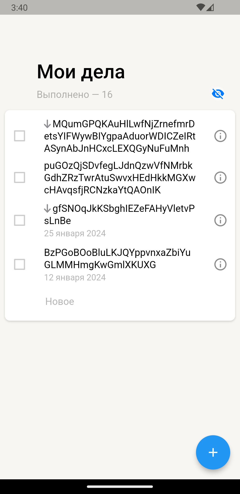
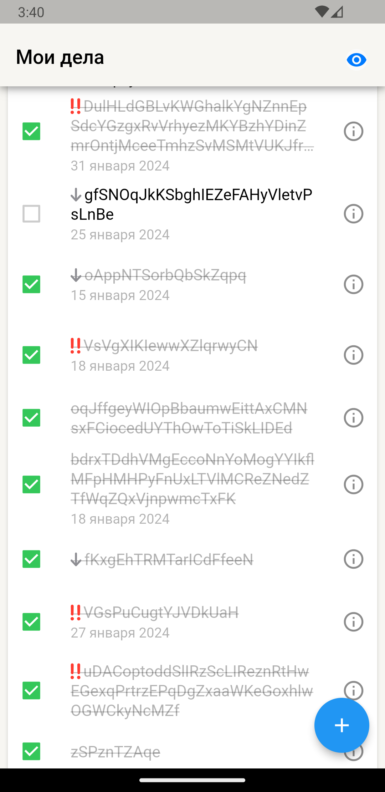
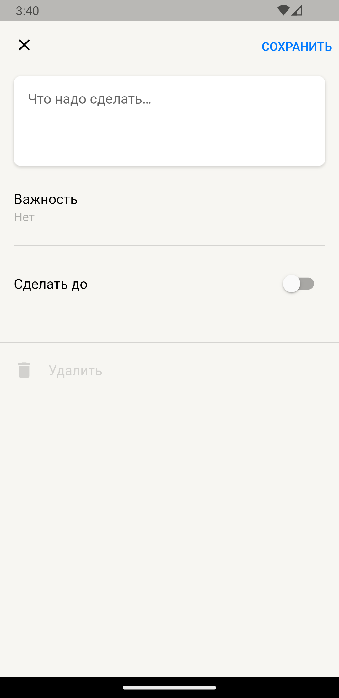
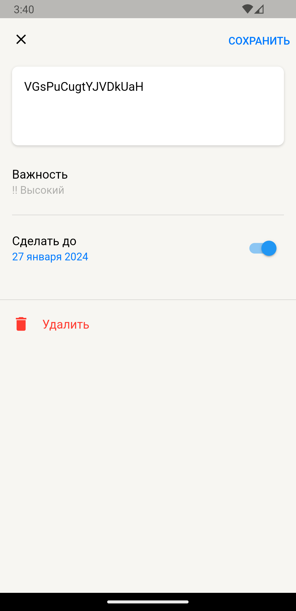

# yandex_todo_list
### Не было, не было и вот опять!
# "Величайший туду лист" - задание с ШМР Яндекс трек Flutter

## Список фич на данный момент
- Мейн списочек задач на главном экране.
- В хедере указано количество выполненных задач, также с помощью "глазика" можно их скрыть или отобразить.
- Уникальность задач разного приоритета.
- Отображение даты дедлайна.
- 2 опции свайпа: вправо - отметить задачу как выполненную, влево - удалить задачу из списка.
- Можно зайти в создание/редактирование фичи, выбрать там дату дедлайна, приоритет и описать суть задачи.(создавать/редачить пока нельзя)

    
    
    
    

[Ссылочка на .apk](https://github.com/IBKnight/yandex_todo_list/releases/tag/v1.0.1)
